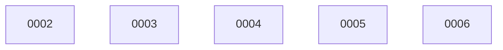

# Backlog

**6 changes** — 🟡 5 proposed · ✅ 1 done

## 🟡 Proposed (5)

| # | Title | Priority | Type | Readiness |
|---|-------|----------|------|-----------|
| [0002](active/0002-workbench-init-onboarding.md) | workbench init — one-command onboarding | `high` | `feat` | needs-brainstorm |
| [0003](active/0003-package-distribution.md) | Package distribution — brew / npm | `medium` | `chore` | build-ready |
| [0004](active/0004-reposition-observability.md) | Reposition docs — observability, not another task tracker | `high` | `docs` | needs-brainstorm |
| [0005](active/0005-strengthen-sync-reliability.md) | Strengthen sync — session-live toward reliable | `medium` | `refactor` | needs-brainstorm |
| [0006](active/0006-layouts-beyond-kanban.md) | Layouts beyond kanban — generic visual substrate | `low` | `feat` | needs-brainstorm |

✅ Archive — done (1)

| # | Title | Merged |
|---|-------|--------|
| [0001](archive/2026-08-24-0001-loopback-bind-default.md) | Bind viz HTTP to 127.0.0.1 by default | 2026-08-24 |

